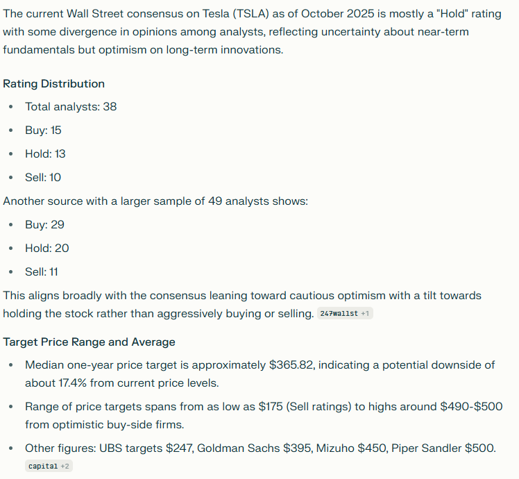
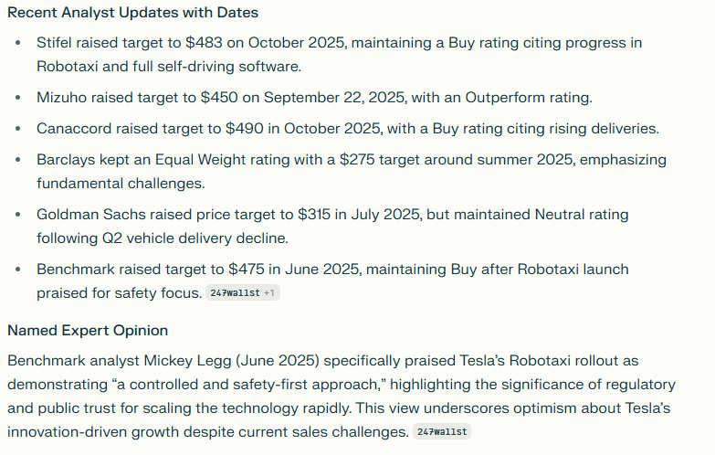

Whenever I'm about to invest in a new stock, I always consult an AI chatbot first—Perplexity or any reliable one works. I prefer Perplexity because it provides charts alongside detailed analysis.
My go-to prompt is: 
```text
What's the current Wall Street consensus on TSLA? 
Please include rating distribution, target price range and average, 
the latest analyst updates with dates, 
and at least one specific named expert opinion.
```
<!-- -->
<!-- -->
<!-- -->
<!-- -->

Always ask for Wall Street’s professional perspective—not the AI’s own opinion.

If the consensus says analysts rate the stock as “Hold” or “Sell,” I usually drop it from my list. 
Analysts tend to avoid giving a “Sell” recommendation because it could damage relationships with companies. 
They often choose “Hold” instead.
So when someone actually issues a “Sell,” that’s a serious warning sign.

I prefer to invest only in stocks with a strong “Buy” consensus—those that analysts are confident will rise over time. 
The price may move down in the short term, but a strong buy means it’s very likely to climb later.

